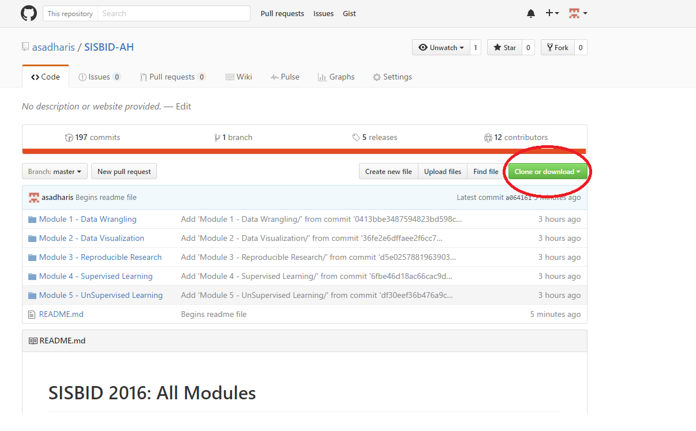
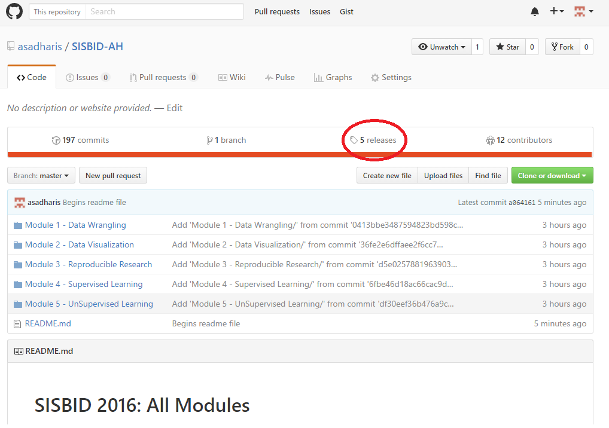
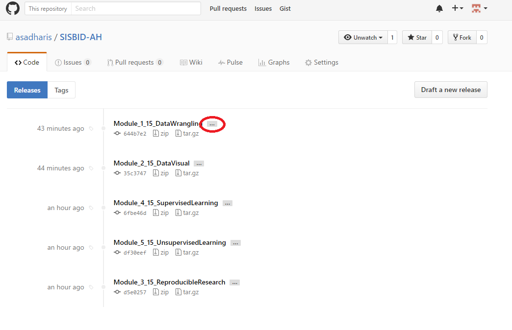
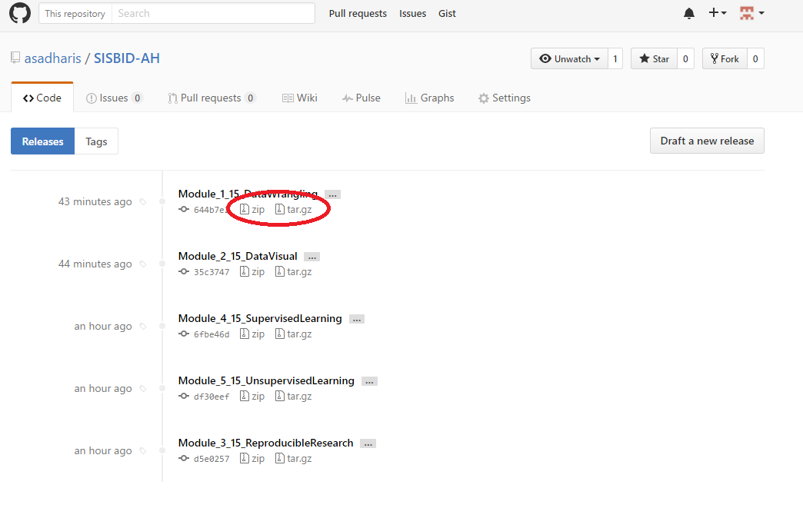
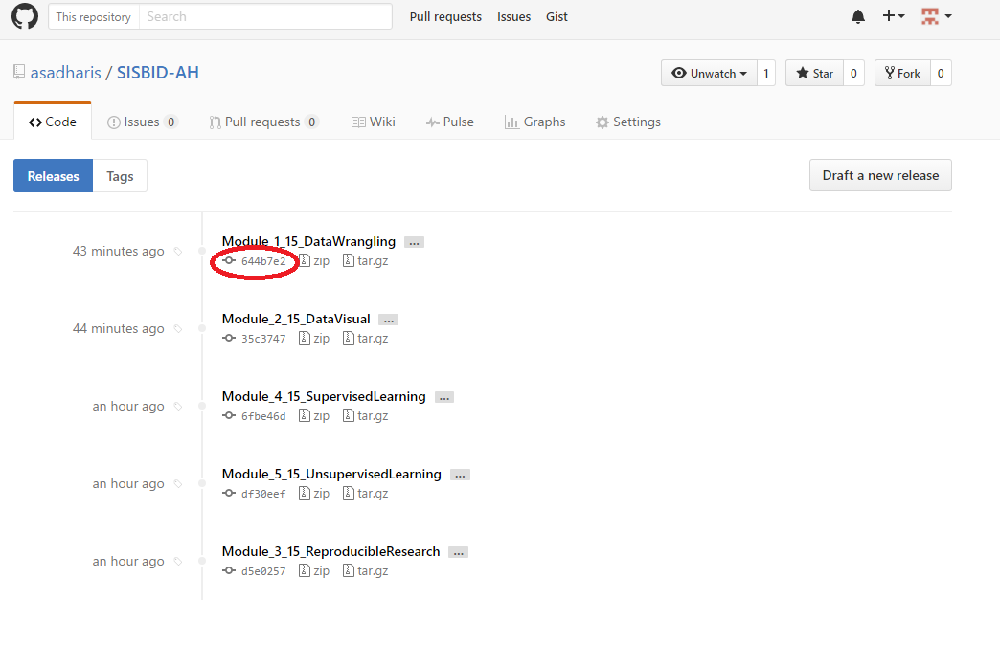
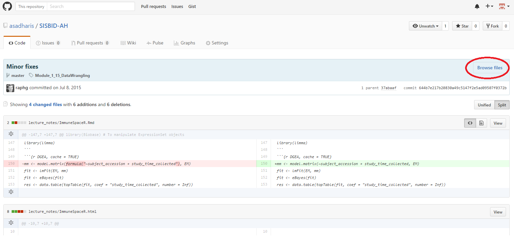

# SISBID 2016: All Modules

Welcome to the SISBID 2016 course repository. Each of the five modules have been organized and grouped within this repository. 

(**IMPORTANT:**) While we will do our best to keep this repository updated, for the latest course material for individual modules please see: <https://github.com/SISBID>


## Information for Downloading Course Material
To obtain all the course material, we have multiple options.

1. Use the 'Clone or download' button on the Github webpage for the repo.

2. In terminal/command line run the following command to clone the repo
```shell
git clone https://github.com/SISBID/SISBID-All-Modules.git
```

## Information for Downloading Last Year's Course Material
All the course material on this repo includes the material used for last year. For downloading material from last year we use `tags` or `release version`. The material can be obtained as follows:

* On the main page of the repo, above the list of directories, follow the link to `releases`.


* To view details of the tag or release version click the `...` icon next to the tag name.


* To download course material from specific tag use the "zip" or "tar.gz" buttons.


* To view details of the commit associated with the tag click the commit icon and to view repo history at point in time of the tag click the "Browse Files" icon.



* (**For Instructors**) To view repo for a previous version using tags we can simply use the `checkout` command.
```shell
# View the list of tags
git tag -l

# Go back in history to check previous version
git checkout [tag name]

# E.g. To checkout to last year's version of Module 1
git checkout Module_1_15_DataWrangling
```


## Information for Instructors 
Instructors are recommended to clone the repository instead of downloading all files as a .zip file. This will import all tags and repo history.

To add tags (release version in Github) we require the following: 
```shell
# Create a tag for a specific commit
# We do not require the full SHA here
git tag [tagname] [commit SHA]

# Pushing tags to Github will require adding an option to the `push` command
git push --tags
```

#### For questions/comment about repo maintenance contact
Asad Haris (aharis@uw.edu)

Dept. of Biostatistics

University of Washington


